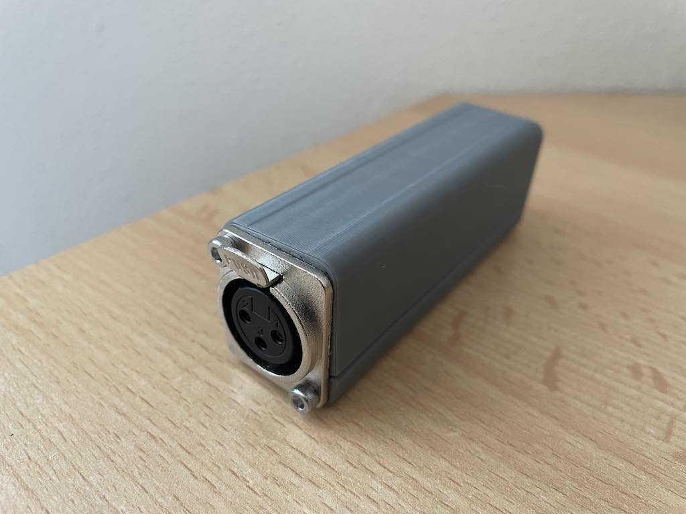
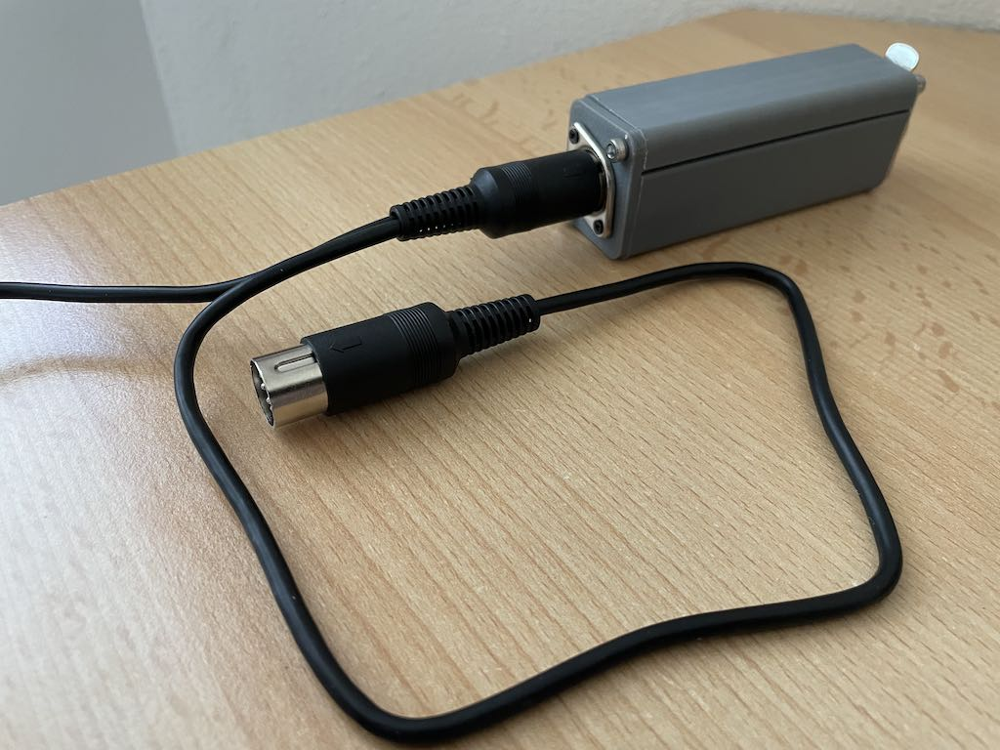
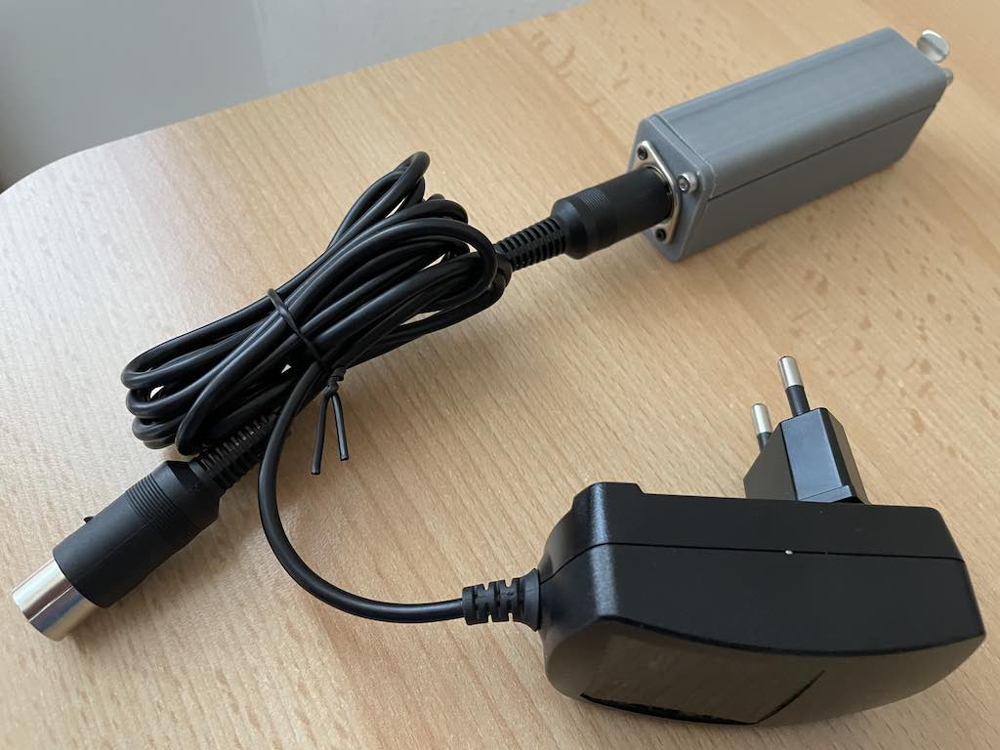

# DMX Smoke Machine Controller

DMX512 controller add-on for the **SDJ / Sagitter / Proel** [**MIMETIK-M**](https://www.sdjlighting.com/en/prodotto/sg-mimetikm-smoke-machine-mimetik-900w/)  smoke machine.
Provides pulse-based DMX smoke control with ready-state detection and a neat 3D-printed enclosure.  

## 💡 Compatibility
- ✅ Tested with **SDJ Mimetik-M**  
- ⚠️ May also work with machines sharing the **same timer/remote port pinout**  
- ❌ Not universal — always check wiring before use  

## ✨ Features
- DMX512 input via RS485 transceiver  
- READY/WARM-UP detection (machine won’t fire until warmed up)  
- Pulse control: DMX value maps to **pulse duration** and **pulse period**  
- Feedback PWM LED (DMX level, pin D6)  
- Smoke pulse LED (mirrors smoke firing, pin D1)  
- READY LED (pin D5)  
- Compact 3D-printed enclosure

## 🛠 Bill of Materials
| Item | Quantity | Notes |
|------|----------|-------|
| Wemos D1 Mini or clone | 1 | Reference/tested board (⚠️ must be powered separately — not from timer port) |
| MAX485 **or** SN75176 module | 1 | RS485 transceiver |
| PN2222 transistor | 1 | Smoke trigger driver |
| LEDs + resistors | optional | Status & feedback indicators |

## 📌 Timer Port Pinout


| Label | Direction | Description |
|-------|-----------|-------------|
| GND   | Common    | Ground reference |
| +5V   | Output    | **Low-current reference only** — cannot power Wemos D1 Mini |
| SMOKE | Input     | Active LOW → pulling to GND triggers smoke |
| READY | Output    | HIGH (3.5V) when warmed up, LOW during warm-up |
| NC    | –         | Not connected |

⚠️ **Important:** The +5V pin from the timer/remote port is **not able to supply enough current to run an Wemos D1 Mini**.  

## 🔌 Arduino Connections
| Wemos D1 Mini Pin | Function | Notes |
|-------------------|----------|-------|
| `D1` | `SMOKE_PULSE_PIN` | LED mirrors smoke pulses     |
| `D2` | `SMOKE_PIN`       | Smoke trigger                |
| `D3` | `DIRECTION_PIN`   | DMX port direction           |
| `D5` | `READY_LED_PIN`   | LED mirrors READY            |
| `D6` | `FEEDBACK_PIN`    | PWM output showing DMX level |
| `D7` | `READY_PIN`       | Input from machine READY     |

# Schematic

## DMX connector wiring
```
Wemos D1 Mini                                                  DMX connector

    +5V  ----------------------------------------------+
                                                       |
     RX  -----------+                                  |
             2kΩ    |   1kΩ       +---------------+    |
    GND  ---/\/\/\--+--/\/\/\-----| R         VCC |----+
                                  |               |
                             +----| RE/         B |----------  Data - (XLR pin 2)
                             |    |    SN75176    |
     D3  --------------------+----| DE          A |----------  Data + (XLR pin 3)
                                  |               |
     D4  -------------------------| D         GND |---+------  Ground (XLR pin 1)
                                  +---------------+   |
                                                      |
    GND  ---------------------------------------------+
```

## DIN 5 pins cable wiring
```
                      Power Supply
                          +5V
                           +
Wemos D1 Mini              |                  MIMETIK-M Timer Port
                           |
     5V  ------------------+----------------  NC

     D7  -----------------------------------  READY


                           +----------------  SMOKE
                           |
                           |
                           |  
                         | /  C
             470-680Ω    |/     
     D2  -----\/\/\/\----|    PN22222         +5V (not connected)
                       B |\
                         | v  E
                           |
                           |
                           | 
    GND  ------------------+----------------  GND
                           |
                           |
                           +
                          GND
                      Power Supply                
```

## Led wiring (optional)
```
Wemos D1 Mini
               220Ω
     D5  -----\/\/\/\-----|>|-----+  Ready LED
                                  |
               220Ω               |
     D6  -----\/\/\/\-----|>|-----+  DMX feedback LED
                                  |
               220Ω               |
     D1  -----\/\/\/\-----|>|-----+  Smoke pulse LED
                                  |
                                  |
    GND  -------------------------+            
```

## ⚙️ Software Behavior
- **DMX channel:** `503` (change in code if desired)
- **READY = LOW** → warm-up → smoke disabled  
- **DMX mapping**  
  - `0` = smoke OFF  
  - `1` = short pulse (**0.1 s ON / 9.9 s OFF**)  
  - `255` = continuous smoke (**1 s ON every 1 s cycle → always ON**)  
  - Intermediate DMX values scale linearly between these extremes  
- **Pulse cycle**  
  - For each cycle:  
    - Smoke ON for mapped duration  
    - Smoke OFF until the mapped period completes  
  - At DMX 255, duration = period → machine runs continuously  
  - Responds instantly to DMX changes mid-cycle  
- **LED indicators**  
  - D5: LED follows READY state  
  - D6: PWM LED shows DMX level  
  - D1: LED mirrors smoke pulse (ON when machine is triggered)  
- **Failsafe**
  - Smoke is forced OFF if:
      - Machine is warming up (READY LOW)
      - DMX signal is lost for >3s
      - DMX=0
      
## 📊 DMX Pulse Example


## ▶️ Usage
1. Print the enclosure and assemble the electronics.  
2. Mount to left or right side of the machine with existing screws.  
3. Connect to the **timer/remote port**.  
4. **Power the Arduino** via USB, barrel jack/VIN, or +5 V pin from a regulated supply.  
   ⚠️ Do **not** use the timer port’s +5 V — it cannot supply enough current.  
5. Upload the Arduino sketch (tested on Uno R3).  
6. Send DMX values to the configured channel.  

## 🔧 PN2222 Transistor Notes

The **PN2222** is a common NPN bipolar junction transistor (BJT) used as a **switch** in the DMX smoke machine controller.

### Purpose

The Wemos D1 Mini’s digital output pin cannot directly drive the smoke machine’s timer input (which typically activates a coil inside the machine, like a relay) because the relay expects **higher current than the Arduino pin can safely supply**. The PN2222 acts as a **current amplifier** to safely trigger the smoke machine.

### How it Works

1. Weamos D1 Mini outputs a small current to the transistor **base** through a resistor (from 470Ω to 680Ω).
2. This turns the transistor **ON**, allowing current to flow from **collector to emitter**, which pulls the smoke trigger line LOW.
3. When the Arduino pin is LOW, the transistor switches OFF, and the smoke line returns to HIGH (inactive).

### Base Resistor Note

* The base resistor sets the current into the transistor’s base.
* It can be replaced with a resistor from **470Ω** to **680Ω** resistor depending on available components.

### Benefits

* Protects the Wemos D1 Mini from excessive current draw.
* Provides fast switching for precise smoke pulses.
* Compatible with standard 5V logic levels.
* Cheap, widely available, and reliable.

## Photos





## ⚠️ Safety Notes
- Smoke machines run on **mains voltage** — isolate low-voltage electronics.  
- Double-check wiring before powering on.  
- Only use with machines confirmed to share the SDJ Mimetik-M pinout.  
- ⚠️ The **+5 V timer port output cannot power the Wemos D1 Mini** (insufficient current).  
  Use USB or the barrel jack with an external supply.  

## 📜 License
MIT License – free to use, adapt, and improve.  
